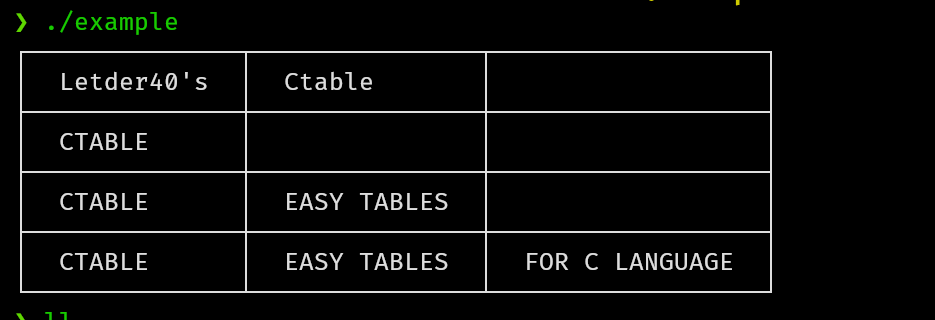

# Ctable

## Introduction
Ctable is a library that allows to generate printable tables easily
This was originally a module of [netcalc](https://github.com/Letder40/netcalc), but I ended creating a library to use this in others c projects.

## How it works?
link the static library lib/libctable.a to your project.

```c
#include <stdio.h>
#include "../include/ctable.h"

int main(int argc, char** argv) {

    Table table = TABLE(
        ROW("Letder40's", "Ctable"),
        ROW("CTABLE"),
        ROW("CTABLE", "EASY TABLES"),
        ROW("CTABLE", "EASY TABLES", "FOR C LANGUAGE")
    );

    TableBuilder builder = table_build(table);

    printf("Ctable usage example:\n");

    //
    // All ctable's components will be freed after this call
    // 
    
    print_table(builder);

    // 
    // It is possible to push more rows before calling table_build() 
    // So it is possible to create a table that will growth dynamically
    // until print_build is called.
    // 

    Table table2 = TABLE(ROW("COLUMN ID", "DATA"));

    for (int i = 0; i < 5; i++) {
        char column[9] = {0};
        snprintf(column, 9, "column %d", i + 1);

        row_t row = ROW(column, "DATA....");
        table_push(&table2, row);
    }

    builder = table_build(table2);
    printf("\nCtable's Dynamic table usage example:\n");
    print_table(builder);
}
```



### Summary

+ Use the macro TABLE to define the table structure.
+ Use the macro ROW to define each row.
+ All memmory allocation will be freed when print_table is called.
